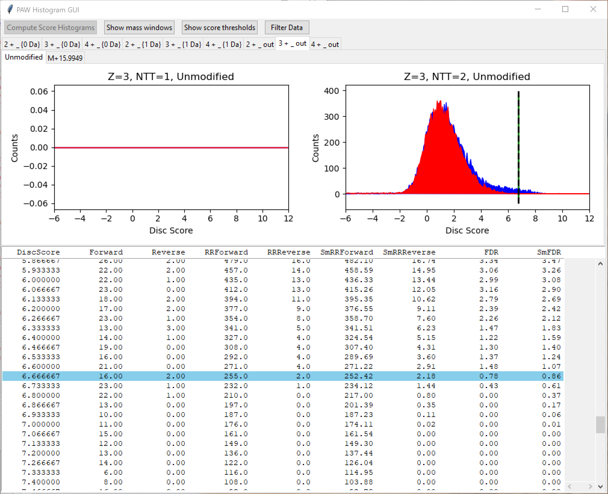

# precursor_mass_corrections
Explores precursor mass correction algorithm assumptions and claims

---

## What does this have to do with precursor mass tolerances?

Narrow tolerance searches have many complications. Incorrect precursor mass and charge assignments strongly affect narrow tolerance searches. The classic case that is mentioned the most is when the monoisotopic peak is not correctly determined. The most common error is assigning the first isotopic peak (the M1 peak) as the monoisotopic peak. I will refer to the instrument picking the M1 peak instead of the monoisotopic peak as an **M1 trigger**. Search engines recognize that this can happen and many have options to try various 1.008 mass shifts to mimic incorrect monoisotopic peak calls. The options in Comet are -1, 0, 1, 2, and 3 times the 1.008 neutron mass. This means that instead of one plus/minus 10 PPM window at 0-Da to define theoretical peptides to score, you use five 10 PPM windows located at the isotopic peak positions. This is a nice solution because you do not have to analyze the data in the MS1 scans to verify precursor mass and charge assignments. The cost is 5 times the search time.

An alternative, if you want to muck about with the MS1 scans, is to find monoisotopic mass errors and/or incorrect charge state assignments associated with the precursors and correct the precursor information for the MS2 scans. This requires running an extra algorithmic step in your pipeline and its time penalty has to be compared to the increased search times from trying isotopic peak shifts. At some level, these seem like similar ways to address the same problem.

## Brief overview

Instruments have to try and determine the monoisotopic precursor mass and precursor charge state in real time during acquisition. This associates an m/z value and charge for the dependent MS2 scans. This is used by search engines to restrict the theoretical peptides to score against the MS2 spectrum. Inaccuracies in the precursor calls can negatively impact search engine performance. If peak spacings of the isotopic distribution of the precursor are not determined correctly, a charge state error can be made. This happens when precursor signals are weak and peaks in the isotopic envelope may be missing.

The true monoisotopic peak (the first one in the isotopic envelope) may be missed and the M1 peak incorrectly assigned as the monoisotopic peak (a +1.008 Da mass error). As peptides get larger the monoisotopic peak gets smaller and the M1 peak gets larger. Above some mass, the M1 peak is the larger peak. When large peptides are low abundance, the monoisotopic peak can easily get lost. It is also not clear if instruments are doing much to define isotopic envelopes or if they just grab the most intense peak in a series of charge-spaced peaks. Generally speaking, peptide size and change state are correlated - higher charge states are probably larger peptides. We might expect M1 triggers to be more common for higher charge state peptides.

Instruments can have mass calibration errors. These can be small, systematic errors that can be recognized in post processing and software corrected by search engines if they are sophisticated enough. Many instruments have hardware mass calibration stabilization. Known contaminant ions (or using special calibrant ions) can be sampled and the instrument tune corrected to make the masses spot on. This has limited correction power and instruments with larger systematic calibration errors can bump up against the correction range limit. This results in some scans getting mass corrections (when the delta is within limits) and some scans left uncorrected (with the larger systematic mass error). This creates deltamass doublets (two peaks instead of one). It is not clear if any software mass correction algorithms are coded for this situation.

There is another complication that has become a bigger problem over time. Less peptide separation has been a growing trend. Single shot experiments (one LC run per sample) have gotten more popular as instrument scan speeds have improved. Multi-dimensional peptide separations can be complicated for chromatography alignment algorithms. Shorter LC gradients make for shorter run times and increase throughput. All of these factors make it more likely that isolation windows (selecting ions to fragment) will have multiple peptide species. Older quadrupoles had isolation windows of about 2 Da. Newer instruments can select ions with good transmission at 0.7 Da (or narrower). The isolation windows are still enormous compared to the precursor resolution.

Co-isolation and co-fragmentation is a complicated problem to address. Many times multiple precursors means more than two. The precursors may have the same or different charge states and be at rather different relative intensities. The precursor window and the fragment ion spectra may be more like a DIA experiment than you think.

This is also coupled with dynamic exclusion. Dynamic exclusion used to be a real sledge hammer for driving finish nails. It was not too long ago that -1 Da to +4 Da were the kinds of dynamic exclusion windows that were blacked out after taking an MS2 scan. You could easily have more than half of the m/z space being excluded with fast scanning instruments. It was also very dynamic as masses went on and off of the exclusion list in rapid order (every 30 seconds is common).

Now the dynamic exclusion is high res with plus/minus 20 PPM in notches over the isotopic envelope. For this to work, the instrument has to be able to determine an isotopic envelope with some fidelity. An M1 trigger does not really affect this, but the charge state call is important. Since the instrument can exclude a precursor with pretty tight mass tolerances, a very similar mass peptide could be selected for an MS2 scan while an excluded peptide is still present. The instrument might co-isolate multiple precursors on purpose. The better dynamic exclusion works, the more problematic data you collect: you can get multiple precursors isolated together, you can get down to ions at the noise level because everything else has already been analyzed. It will be harder to determine isotopic envelopes for weaker ion signals.    

## Recent papers describing algorithms to correct precursor mass and charge state calls

[iPE-MMR paper](https://pubs.acs.org/doi/abs/10.1021/ac101388b?casa_token=s-zCv8N-G94AAAAA%3A123WZzrHgydnHfdqIzn4X3Msc0PGXWa4LFcopnIY0wlMxDokL6q1hvPzA4ez5jZSLygMp-O5fuVdDw&)

> Jung, H.J., Purvine, S.O., Kim, H., Petyuk, V.A., Hyung, S.W., Monroe, M.E., Mun, D.G., Kim, K.C., Park, J.M., Kim, S.J. and Tolic, N., 2010. Integrated post-experiment monoisotopic mass refinement: an integrated approach to accurately assign monoisotopic precursor masses to tandem mass spectrometric data. Analytical chemistry, 82(20), pp.8510-8518.

[RawConverter paper](https://pubs.acs.org/doi/abs/10.1021/acs.analchem.5b02721?casa_token=VO-i__7ztykAAAAA:KaEBW25jSsiQmqcvzdtsd7DueCfeuHgEDvr1ZXv4Ymwq9y8JRK0arNHh_tjzm0Aaybsqh9a8NsK-7g)

> He, L., Diedrich, J., Chu, Y.Y. and Yates III, J.R., 2015. Extracting accurate precursor information for tandem mass spectra by RawConverter. Analytical chemistry, 87(22), pp.11361-11367.

[Monocle paper](https://pubs.acs.org/doi/abs/10.1021/acs.jproteome.0c00563?casa_token=DzzesZv3fdAAAAAA:sDuBKpnjXwAlfU2A0G77wXOV0MDScWCLznDIxhWM5OZe7ONWKvtCEE2KP556moITh3uYA2QzEjor_w)

> Rad, R., Li, J., Mintseris, J., O’Connell, J., Gygi, S.P. and Schweppe, D.K., 2020. Improved Monoisotopic Mass Estimation for Deeper Proteome Coverage. Journal of Proteome Research, 20(1), pp.591-598.

All of these papers talk up how the instruments can't get anything right (as mentioned above) and that you get huge gains by using these algorithms. Being good, skeptical scientists, we should have several questions: are the instruments doing as poorly as suggested? What is the break down on what is broken? How successful are the fixes? How was success defined? How huge is huge? What problem are these algorithms really solving?

They all suffer from some similar issues. They all state (assume) the problems in monoisotopic mass and charge calls are large without demonstrating (in some direct way) that the problems are large. They do not separate and quantify the types of errors in the test datasets and test the algorithm performance on each type of error (an M1 trigger, multiple precursors, etc.). Degree of peptide separation was not explored. More separation usually improves signal-to-noise for precursors (because more sample can be loaded) and reduces the chances for co-eluting peptides. These factors are pretty important to the assumed reasons for using said algorithms. They do not tally what fraction of precursors lack enough information to make corrections. Interestingly, Thermo has acquisition methods that acquire MS2 scans on anything it can if all higher quality precursors have been exhausted and there is still time available in the cycle.

The common method used to evaluate the MS1 peak processing algorithms was indirectly by seeing how many peptides and proteins a search engine can identify with and without the algorithm corrections. The first issue is that counting PSMs is the only thing you need to count. The numbers of identified peptide sequences and identified proteins is linearly correlated with the PSM count. Comparing identified peptides and proteins is more complicated (and dicy) than comparing PSMs and likely causes more confusion than clarity. The other issue is that there is a lot of data processing between the MS2 scan and the PSM counting. You have protein database choices, search engine choices, search engine parameter choices, post processing of search scores, target/decoy FDR methods, and protein inference. There is an implied assumption that a narrow tolerance search is the only thing worth evaluating.

While improving PSM identifications at the end of the day is obviously a desirable goal, such an indirect evaluation method sheds little light on the correction algorithms. What are the precursor error characteristics of the data before and after the running the algorithms? Did the algorithms offer advantages over applying the similar fixes built into the search engines (isotopic errors, deamidation, etc.)? All of the papers showed that PSM numbers could be improved when using narrow tolerance searches without really answering the questions of how and why. A low level algorithm should be evaluated at a low level if you really want to understand the problem and its solution.  

## Monocle paper has data at PRIDE

Monocle is the new kid on the block and was probably developed to facilitate real time search data acquisition. The algorithm was tested on triplet single shot yeast or HeLa cell digests on a Lumos instrument. I skipped the FAIMS data and the TMT-labeled data and repeated analysis of the label-free runs where the survey scans were from the Orbitrap and the MS2 scans were low res ion trap CID. The numbers in the manuscript are more complete for yeast, so I will focus on that data.

The paper used Comet searches with a 50 PPM parent ion mass tolerance, tryptic cleavage, variable oxidation of Met, and static alkylation of Cys. The 178K spectra were searched with and without monocle pre-processing. Monocle does isotopic envelope modeling based on averagine. It is not clear how (if) modeling of multiple precursors is handled or if a single corrected monoisotopic mass is computed for each MS2 scan. Regardless, monocle pre-processed data resulted in 81% more PSMs.

## [PAW processing](https://github.com/pwilmart/PAW_pipeline)

The wide tolerance PAW searches identify deamidation and M1 triggers without having to specify those as search parameters. Every PAW analysis generates deltamass histograms for 2+, 3+, and 4+ peptides. Windows on deltamass peaks are used to create conditioned score histograms for peptides by charge state, number of tryptic termini, and by modification state.

**Basic pipeline steps:**

- Convert RAW files with MSConvert
- Run Comet search engine
- Create top-hit summary files  
- Compute delta mass and score histograms
- Set 1% FDR thresholds
- Write filtered top hit files
- Make peptide and protein reports

The histogram-based FDR analysis is unique to the PAW pipeline and incorporates a great deal of quality control information naturally into the workflow. Instead of a target/decoy score distribution figure made once for the paper describing a tool, deltamass and score visualizations are integrated into the PAW workflow for every analysis.

**Histogram-based FDR steps:**
- Read top-hit summary files
- Filter top-hits by charge (2-4) and length (>7)
- Compute deltamass histograms
  - Separated by charge state
  - MH+ masses in Daltons (never PPM)
  - Full range (-1.25 Da to +1.25 Da [or wider]) plot
  - Expanded plots at 0-Da and 1-Da regions
- Set windows on deltamass regions with correct matches
- Compute deltamss-conditioned score distributions
- Peptides are subclassed by:
  - Deltamass window
  - Charge state
  - Modification state
  - Number of tryptic termini
- Thresholds set in each subclass
  - Thresholds are independent and do not have to be the same
  - Usually 1% FDR in all subclasses
- Scans passing thresholds are written to new filtered top-hit files

This is some of the quality control information that is always available:

- Mass calibration errors. Good data will have a single, narrow deltamass target peak centered at 0-Da. Sytematic errors will have the peak shifted away from 0-Da. Data in batches may have slighly different mass calibration errors and the single peak may be wider or be multiple peaks. Data where the lock mass correction is failing intermittently may also have a doublet peak.

- How much deamidation and M1 triggering can be seen in the 1-Da region. Typical Orbitrap survey scan resolutions will resolve these two peaks (0.984 Da and 1.008 Da). It is very unlikely that incorrect peptide sequences will be assigned to peptides with 1-Da mass shifts in wide tolerance searches.

- Target/decoy error model is tested for every dataset. Target matches have two distributions: a low score incorrect distribution and a higher score correct match score distribution. The decoy sequences should produce a mirror incorrect score distribution and overlay the incorrect target score distribution. By plotting histograms in different colors (red for decoys and blue for target matches), the concordance of the two incorrect distributions can be easily checked.

- Presence or absence of correct matches in any peptide subclass are trivial to determine. This can be useful to see if the samples had any actual protein (amazingly, some experiments do not work or your instrument may be in the crapper). It can also be handy to verify specific PTMs. Note: the approach used in PAW does not scale well to more complicated search strategies.

- Identification rates by charge state and overall ID rates can be determined.

## Back to the yeast data

My pipeline uses [Comet](https://analyticalsciencejournals.onlinelibrary.wiley.com/doi/full/10.1002/pmic.201200439?casa_token=Z-eaugqi5FsAAAAA%3AvoMDHcIm0110hMJeAXzQ9Op7ZDYOwK3xbr4xh4o6xzvSeKOFfdqEk3wp84A63eAPUngHjYlSqePX), a [PeptideProphet-like discriminant function](https://pubs.acs.org/doi/abs/10.1021/ac025747h?casa_token=44xQl90kyMoAAAAA%3Am8LcQavleMRSnki_M90GbL7pO_wf1kZCLp5Nq-42AmIp00e2_wzFRXmpC0pmzaOeNeEAEMRrQcf4pQ&), the [target/decoy method](https://www.nature.com/articles/nmeth1019) for FDR control, and a visual histogram-based score threshold workflow. I configured a 50 PPM search with similar parameters as were used in the Monocle paper. I also performed a 1.25 Da wide parent ion mass tolerance search. I did not run PAW on any monocle pre-processed data. The numbers of PSMs identified at 1% FDR are given in the table below (comma is the thousands separator).

What|Count|Gain
----|-----|----
Total MS2 Scans|178,377|
PSMs: 1% FDR, 50 ppm, paper|43,008|0%
PSMs after monocle|77,859|81%
PSMs: 1% FDR, 50 ppm, PAW|45,079|5%
PSMs: 1% FDR, 1.25 Da, PAW|65,460|52%

The PAW processing had 5% more IDs at 50 PPM compared to the Gygi Lab in-house software. Despite an unoptimized discriminant function that is very similar to the original PeptideProphet model from 2001, the approach in the PAW workflow of setting deltamass conditioned score distributions for peptides in subclasses is a pretty sensitive peptide ID framework.

Interestingly, using a wide parent ion mass tolerance in PAW with exactly the same starting data increased identified PSMs by 52% compared to 50 PPM. In the 50 PPM searches, the option to try isotopic errors was not used. Deamidation was also not specified as a PTM. The only change in the Comet parameters was the parent ion tolerance. It seems that parent ion mass corrections are not necessary to dramatically increase PSM counts. Maybe the problem is not parent ion masses but the narrow tolerance search choice.

## Time to get into the weeds

In the yeast data, 98% of the IDs are 2+ and 3+ peptides; only 2% of the IDs are 4+ peptides. The 2+ to 3+ ratio is about 2 to 1 (pretty typical for trypsin digests). Here are the full-range deltamass histograms for the 1.25 Da search.

Target matches are in blue and decoy matches are in red. We see the sharp peak at 0-Da for peptides where the instrument software got the monisotopic mass call correct. We see a second peak at +1.008 Da from M1 triggers. As expected, the M1 peak (compared to the 0-Da peak) increases as a function of charge state due to larger peptides. This data has very little deamidation present. In most datasets, there are two peaks in the 1-Da region. We see that incorrect matches are broadly distributed over the full deltamass range and that the decoy matches accurately model the behavior of the incorrect target matches.

The overall fraction of PSMs associated with the M1 peak is 22% across the 3 charge states. This represents kind of an upper limit on how much a parent ion correction algorithm could gain due to monoisotopic mass miss-calls. Note that I did not try a 2.5 Da search to see if the M2 triggers are appreciable. One would expect them to be significantly reduced compared to M1 triggers (maybe a few percent).

Narrow windows around the two peak regions (for each charge state) were set and three collections of conditioned histograms generated for the 0-Da peak, the 1-Da peak(s), and any deltamasses outside of these two windows. Here are the score distributions for the 0-Da and 1-Da unmodified peptides (the oxidized methionine distributions are similar but have fewer counts and are not shown here [they are shown at the bottom of this file]).

Again, the decoy distribution is in red and the two-distribution target matches are in blue. The dotted lines are the 1% FDR threshold locations. The 50 PPM search results are on the left. The two 1.25 Da results are on the right. We do not have any 1-Da peaks in the 50-PPM search, just the 0-Da peak. In the 1.25 Da search, we have both deltamass regions. We see that the relative noise level is higher for the 1-Da region compared to the 0-Da region in the 1.25 Da search.

This is where counting identified PSMs as an indirect way to evaluate parent ion mass corrections rears its ugly head. I talk about how FDR control, overlap between the two distributions, and their relative magnitudes are all intertwined like the computer cables under your desk in [this repository](https://github.com/pwilmart/score_distributions_FDR). If you have not looked at that, you might want to give it a quick skim before reading on. The 50 PPM score distributions have larger red distributions than the 0-Da histograms for the 1.25 Da search. The score threshold have to be increased (they are near 3.0) and correct ID recovery decreases some. We also have all of the M1 triggers that we can ID in the 1.25 Da search that are excluded in the basic 50 PPM search.

We also have some peptide IDs where we did not have a deltamass around 0-Da or 1-Da.

It is human nature to want to ignore those. We paid big money for that Orbitrap and every ion better have a gosh darn accurate mass or we are sending that box back to Thermo... Your data may have some thoughts on that and maybe we should listen to the data. After all, the mass spec never lies. Again, we have decoy match scores in red and target match scores in blue. We see that the decoy random error model matches the incorrect target distribution very well. We also see that we do in fact have a lot of IDs that do not have an accurate mass.

We could come up with a list of unsupported speculations as to why that might be. I think that the most likely thing that is going on here, where a complex proteome is being separated in a single LC run, is co-isolated co-eluting peptides (of the same charge state). The instrument assigns a parent ion mass to the MS2 spectrum based on its algorithms (how it picks monoisotopic peaks and does dynamic exclusion). The monoisotopic mass call may not jibe with the fragment ions that produce the highest Comet scores. When we have a wide parent ion mass tolerance, we can sample more theoretical peptides and find better scoring matches. What ever peptide scores best will be the top hit whether it has accurate mass agreement with the precursor call or not.

There is more going on here, though. We have far fewer "extra" IDs from the 50 PPM search compared to the 1.25 Da search. We also have differences in the score distribution shapes. With 50 PPM, we have a more right-hand-tailed red distribution. That pushes the score threshold up to over 6.0. In the 1.25 Da search, the threshold is around 4.0. This could be that the 50 PPM search is coercing incorrect sequences onto higher quality MS2 spectra resulting in atypically high scoring decoy matches. It can also be partly due to 50 PPM tolerances having few scored peptides for some m/z values. The discriminant function used in PAW has a heavy weighting on the deltaCN term, which can be erratic when there are few scored peptides. This effect is hit and miss as many m/z values will have many matches and some will have small numbers of matches. What ever the reasons, narrow tolerance searches do not recover the inaccurate mass matches as well as wide tolerance searches do.

## Wrap time

I did not run monocle on the data and process that with my pipeline (I do not have unlimited time - sorry). I think I have made the case that instrument monoisotopic mass mis-calls is only part of the story. Using a narrow tolerance search is also a big part of the issue (as are co-eluting peptides). A wide tolerance search was dramatically better than the narrow tolerance search (keep in mind that some folks think 50 PPM is a wide tolerance) with about half of the gain coming from M1 triggers. The other half came from better recovery of correct IDs, especially those with larger deltamass differences.

There is much more work that needs to be done to finish exploring this topic. We can reduce the crowded separation space problem with more fractionation. How to compare a larger separation to single shot run is, of course, not simple. You have to be smart to figure out the metrics that are not dependent on the sampling depth difference. There may be questions about whether the correct PSMs are really correct. Co-fragmenting peptides make that challenging. Assigning one sequence one time and another sequence under different conditions could both be correct. Having the same sequence for the same MS2 scan may not be a signature of correctness. Analysis methods that increase PSM count should probably add more PSMs to high and medium abundance proteins. Every confidently identified protein always has additional low abundance, lower scoring peptides. More correct peptides should increase protein coverages.

The work in the papers I listed above is pretty good. They do not have any glaring flaws. I do think that they all come up a bit short on the science side. The papers are about algorithms to correct MS1 data. They end up mostly confounding how parent ion information, fragment ion spectra, and search engines affect PSM identifications. This is an interesting topic, but it is getting a little far from how well do mass spectrometers measure monoisotopic masses.

Search engines have options to address many of these issues when performing narrow tolerance searches. I have explored these with the [sea lion urine](https://github.com/pwilmart/Sea_lion_urine_SpC) data but I need more time to complete and share that work. The urine samples are a much more realistic matrix than yeast digests or HeLa digest. Yeast and HeLa cells are too good to really test things. You could fix the reputation of proteomics overnight by restricting grant funding to studies of yeast and HeLa cells. That could make proteomics so amazingly reproducible that it would be the envy of the rest of experimental science.

---

## Supplemental Baggage

Here are the screen shots from the PAW pipeline (for both searches) in all of their glory for those who just can't get enough of these styling histogram plots!

---

1.25 Da search:

      

---

50 PPM search:

---

April 21, 2021  
Phil Wilmarth
